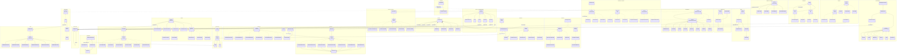

# Hamburgueria - 23 Padroes de Projeto em Java

## Diagrama de Classes

```mermaid
classDiagram
    direction TB

    namespace STATE {
        class PedidoContext
        class PedidoEstado { <<abstract>> }
        class PedidoEstadoPendente
        class PedidoEstadoConfirmado
        class PedidoEstadoEmPreparo
        class PedidoEstadoEntregue
        class PedidoEstadoCancelado
        class PedidoEstadoDevolvido
    }
    PedidoContext o-- PedidoEstado
    PedidoEstado <|-- PedidoEstadoPendente
    PedidoEstado <|-- PedidoEstadoConfirmado
    PedidoEstado <|-- PedidoEstadoEmPreparo
    PedidoEstado <|-- PedidoEstadoEntregue
    PedidoEstado <|-- PedidoEstadoCancelado
    PedidoEstado <|-- PedidoEstadoDevolvido

    namespace OBSERVER {
        class Observable { <<interface>> }
        class Observer { <<interface>> }
        class Mesa
        class Cliente
    }
    Observable <|.. Mesa
    Observer <|.. Cliente
    Mesa o-- Observer
    Mesa --> PedidoContext : avanca estado

    namespace SINGLETON {
        class Configuracoes
    }
    Configuracoes --> Configuracoes : instance

    namespace FACTORY_METHOD {
        class IServico { <<interface>> }
        class ServicoFactory
        class ServicoRealizarPedido
        class ServicoEmitirNota
        class ServicoCancelarPedido
        class ServicoEntregarPedido
        class ServicoProcessarPagamento
    }
    ServicoFactory ..> IServico
    IServico <|.. ServicoRealizarPedido
    IServico <|.. ServicoEmitirNota
    IServico <|.. ServicoCancelarPedido
    IServico <|.. ServicoEntregarPedido
    IServico <|.. ServicoProcessarPagamento

    namespace ABSTRACT_FACTORY {
        class FabricaAbstrata { <<interface>> }
        class Lanche { <<interface>> }
        class Acompanhamento { <<interface>> }
        class FabricaClassico
        class FabricaGourmet
        class FabricaVegano
        class LancheClassico
        class LancheGourmet
        class LancheVegano
        class AcompanhamentoClassico
        class AcompanhamentoGourmet
        class AcompanhamentoVegano
        class FabricaProvider
    }
    FabricaProvider ..> FabricaAbstrata
    FabricaAbstrata <|.. FabricaClassico
    FabricaAbstrata <|.. FabricaGourmet
    FabricaAbstrata <|.. FabricaVegano
    Lanche <|.. LancheClassico
    Lanche <|.. LancheGourmet
    Lanche <|.. LancheVegano
    Acompanhamento <|.. AcompanhamentoClassico
    Acompanhamento <|.. AcompanhamentoGourmet
    Acompanhamento <|.. AcompanhamentoVegano
    FabricaAbstrata ..> PedidoTemplate : cria PROTOTYPE

    namespace BRIDGE {
        class TipoRelatorio { <<interface>> }
        class Funcionario { <<abstract>> }
        class FuncionarioGerente
        class FuncionarioCaixa
        class FuncionarioCozinheiro
        class FuncionarioAtendente
        class RelatorioVendas
        class RelatorioEstoque
        class RelatorioFinanceiro
        class RelatorioPedidos
        class RelatorioDesempenho
    }
    Funcionario o-- TipoRelatorio
    Funcionario <|-- FuncionarioGerente
    Funcionario <|-- FuncionarioCaixa
    Funcionario <|-- FuncionarioCozinheiro
    Funcionario <|-- FuncionarioAtendente
    TipoRelatorio <|.. RelatorioVendas
    TipoRelatorio <|.. RelatorioEstoque
    TipoRelatorio <|.. RelatorioFinanceiro
    TipoRelatorio <|.. RelatorioPedidos
    TipoRelatorio <|.. RelatorioDesempenho
    Funcionario --> Configuracoes : le SINGLETON

    namespace STRATEGY {
        class Operacao { <<interface>> }
        class Calculadora
        class OperacaoSemDesconto
        class OperacaoDesconto
        class OperacaoAcrescimo
        class OperacaoTaxaEntrega
        class OperacaoCupom
        class OperacaoFidelidade
    }
    Calculadora o-- Operacao
    Operacao <|.. OperacaoSemDesconto
    Operacao <|.. OperacaoDesconto
    Operacao <|.. OperacaoAcrescimo
    Operacao <|.. OperacaoTaxaEntrega
    Operacao <|.. OperacaoCupom
    Operacao <|.. OperacaoFidelidade

    namespace BUILDER {
        class LanchePersonalizado
        class LancheBuilder
    }
    LancheBuilder ..> LanchePersonalizado
    LancheBuilder ..> IngredienteDecorator : buildDecorado DECORATOR

    namespace CHAIN_OF_RESPONSIBILITY {
        class Aprovador { <<abstract>> }
        class SolicitacaoDesconto
        class Atendente
        class Supervisor
        class Gerente
        class Dono
    }
    Aprovador o-- Aprovador : proximo
    Aprovador <|-- Atendente
    Aprovador <|-- Supervisor
    Aprovador <|-- Gerente
    Aprovador <|-- Dono
    Aprovador ..> SolicitacaoDesconto
    Atendente --> Configuracoes : le SINGLETON
    Supervisor --> Configuracoes : le SINGLETON
    Gerente --> Configuracoes : le SINGLETON

    namespace TEMPLATE_METHOD {
        class PreparoLanche { <<abstract>> }
        class PreparoSmashBurguer
        class PreparoXBurguer
        class PreparoVegano
        class PreparoFrango
    }
    PreparoLanche <|-- PreparoSmashBurguer
    PreparoLanche <|-- PreparoXBurguer
    PreparoLanche <|-- PreparoVegano
    PreparoLanche <|-- PreparoFrango
    PreparoLanche --> ServicoFactory : usa FACTORY METHOD

    namespace MEDIATOR {
        class Central
        class Pessoa { <<abstract>> }
        class Setor { <<interface>> }
        class ClienteHamburgueria
        class CozinhaSetor
        class CaixaSetor
        class EntregaSetor
    }
    Central o-- Pessoa
    Central o-- Setor
    Pessoa <|-- ClienteHamburgueria
    Setor <|.. CozinhaSetor
    Setor <|.. CaixaSetor
    Setor <|.. EntregaSetor
    Pessoa --> Central
    Central ..|> Observable : usa OBSERVER

    namespace FACADE {
        class PedidoFacade
        class SetorEstoque
        class SetorCozinha
        class SetorPagamento
        class SetorEntrega
    }
    PedidoFacade *-- SetorEstoque
    PedidoFacade *-- SetorCozinha
    PedidoFacade *-- SetorPagamento
    PedidoFacade *-- SetorEntrega
    PedidoFacade --> FilaCozinha : usa COMMAND
    PedidoFacade --> Calculadora : usa STRATEGY
    PedidoFacade --> Configuracoes : le SINGLETON
    PedidoFacade --> iPagamento : usa ADAPTER

    namespace COMPOSITE {
        class Conteudo { <<abstract>> }
        class Item
        class Combo
        class Cardapio
    }
    Conteudo <|-- Item
    Conteudo <|-- Combo
    Combo o-- Conteudo
    Cardapio --> Conteudo

    namespace MEMENTO {
        class CarrinhoEstado { <<interface>> }
        class CarrinhoSnapshot
        class Carrinho
        class HistoricoCarrinho
        class CarrinhoEstadoAberto
        class CarrinhoEstadoFechado
        class CarrinhoEstadoPago
        class CarrinhoEstadoEmEntrega
        class CarrinhoEstadoEntregue
        class CarrinhoEstadoCancelado
    }
    CarrinhoEstado <|.. CarrinhoSnapshot
    CarrinhoEstado <|.. CarrinhoEstadoAberto
    CarrinhoEstado <|.. CarrinhoEstadoFechado
    CarrinhoEstado <|.. CarrinhoEstadoPago
    CarrinhoEstado <|.. CarrinhoEstadoEmEntrega
    CarrinhoEstado <|.. CarrinhoEstadoEntregue
    CarrinhoEstado <|.. CarrinhoEstadoCancelado
    Carrinho ..> CarrinhoSnapshot
    HistoricoCarrinho o-- CarrinhoSnapshot
    HistoricoCarrinho --> Comando : desfaz COMMAND

    namespace VISITOR {
        class Elemento { <<interface>> }
        class Visitante { <<interface>> }
        class ItemCardapio
        class ComboCardapio
        class Promocao
        class VisitanteRelatorio
        class VisitanteAuditoria
        class VisitanteDesconto
    }
    Elemento <|.. ItemCardapio
    Elemento <|.. ComboCardapio
    Elemento <|.. Promocao
    Visitante <|.. VisitanteRelatorio
    Visitante <|.. VisitanteAuditoria
    Visitante <|.. VisitanteDesconto
    Elemento ..> Visitante
    VisitanteRelatorio --> CardapioHamburgueria : usa ITERATOR

    namespace DECORATOR {
        class IngredienteDecorator { <<interface>> }
        class LancheBase
        class IngredienteDecoradorBase { <<abstract>> }
        class ComQueijo
        class ComBacon
        class ComAlface
        class ComTomate
        class ComPickles
        class ComOvo
        class ComCatupiry
        class ComMolhoEspecial
    }
    IngredienteDecorator <|.. LancheBase
    IngredienteDecorator <|.. IngredienteDecoradorBase
    IngredienteDecoradorBase o-- IngredienteDecorator
    IngredienteDecoradorBase <|-- ComQueijo
    IngredienteDecoradorBase <|-- ComBacon
    IngredienteDecoradorBase <|-- ComAlface
    IngredienteDecoradorBase <|-- ComTomate
    IngredienteDecoradorBase <|-- ComPickles
    IngredienteDecoradorBase <|-- ComOvo
    IngredienteDecoradorBase <|-- ComCatupiry
    IngredienteDecoradorBase <|-- ComMolhoEspecial

    namespace ITERATOR {
        class Iteravel { <<interface>> }
        class Iterador { <<interface>> }
        class ItemPedido
        class CardapioHamburgueria
        class IteradorCardapio
        class IteradorPorCategoria
        class IteradorDisponiveis
        class IteradorPorFaixaPreco
    }
    Iteravel <|.. CardapioHamburgueria
    Iterador <|.. IteradorCardapio
    Iterador <|.. IteradorPorCategoria
    Iterador <|.. IteradorDisponiveis
    Iterador <|.. IteradorPorFaixaPreco
    CardapioHamburgueria o-- ItemPedido
    Iterador ..> ItemPedido
    CardapioHamburgueria --> Conteudo : carrega COMPOSITE

    namespace PROTOTYPE {
        class Clonavel { <<interface>> }
        class EnderecoEntrega
        class PedidoTemplate
        class RegistroPedidos
    }
    Clonavel <|.. EnderecoEntrega
    Clonavel <|.. PedidoTemplate
    PedidoTemplate o-- EnderecoEntrega
    RegistroPedidos o-- PedidoTemplate

    namespace FLYWEIGHT {
        class Ingrediente
        class IngredienteFactory
        class PedidoFlyweight
        class HamburgueriaFlyweight
    }
    IngredienteFactory ..> Ingrediente
    PedidoFlyweight o-- Ingrediente
    HamburgueriaFlyweight o-- PedidoFlyweight
    HamburgueriaFlyweight --> Combo : monta COMPOSITE

    namespace COMMAND {
        class Comando { <<interface>> }
        class PedidoCozinha
        class FilaCozinha
        class AbrirPedidoComando
        class FecharPedidoComando
        class IniciarPreparoComando
        class FinalizarPreparoComando
        class AdicionarItemComando
        class AplicarDescontoComando
        class CancelarPedidoComando
    }
    Comando <|.. AbrirPedidoComando
    Comando <|.. FecharPedidoComando
    Comando <|.. IniciarPreparoComando
    Comando <|.. FinalizarPreparoComando
    Comando <|.. AdicionarItemComando
    Comando <|.. AplicarDescontoComando
    Comando <|.. CancelarPedidoComando
    FilaCozinha o-- Comando
    AbrirPedidoComando --> PedidoCozinha
    FecharPedidoComando --> PedidoCozinha
    IniciarPreparoComando --> PedidoCozinha
    FinalizarPreparoComando --> PedidoCozinha
    AdicionarItemComando --> PedidoCozinha
    AplicarDescontoComando --> PedidoCozinha
    CancelarPedidoComando --> PedidoCozinha

    namespace ADAPTER {
        class iPagamento { <<interface>> }
        class iEntrega { <<interface>> }
        class PagamentoPix
        class PagamentoCartao
        class SistemaPagamentoLegado
        class PagamentoLegadoAdapter
        class SistemaEntregaExterna
        class EntregaExternaAdapter
        class CaixaRegistradora
    }
    iPagamento <|.. PagamentoPix
    iPagamento <|.. PagamentoCartao
    iPagamento <|.. PagamentoLegadoAdapter
    PagamentoLegadoAdapter o-- SistemaPagamentoLegado
    iEntrega <|.. EntregaExternaAdapter
    EntregaExternaAdapter o-- SistemaEntregaExterna
    CaixaRegistradora ..> iPagamento
    CaixaRegistradora ..> iEntrega

    namespace PROXY {
        class ICardapio { <<interface>> }
        class CardapioReal
        class CardapioProxy
        class BancoDados
        class FuncionarioAcesso
    }
    ICardapio <|.. CardapioReal
    ICardapio <|.. CardapioProxy
    CardapioProxy o-- CardapioReal
    CardapioProxy --> FuncionarioAcesso
    CardapioProxy --> Configuracoes : valida SINGLETON
    CardapioReal --> BancoDados

    namespace INTERPRETER {
        class ExpressaoCardapio { <<interface>> }
        class ValorNumerico
        class Adicao
        class Subtracao
        class Multiplicacao
        class Divisao
        class Percentual
        class CalculadoraCardapio
        class PedidoInterpreter
        class HamburgueriaInterpreter
    }
    ExpressaoCardapio <|.. ValorNumerico
    ExpressaoCardapio <|.. Adicao
    ExpressaoCardapio <|.. Subtracao
    ExpressaoCardapio <|.. Multiplicacao
    ExpressaoCardapio <|.. Divisao
    ExpressaoCardapio <|.. Percentual
    Adicao o-- ExpressaoCardapio
    Subtracao o-- ExpressaoCardapio
    Multiplicacao o-- ExpressaoCardapio
    Divisao o-- ExpressaoCardapio
    Percentual o-- ExpressaoCardapio
    CalculadoraCardapio ..> ExpressaoCardapio
    CalculadoraCardapio --> Calculadora : usa STRATEGY
    PedidoInterpreter o-- ExpressaoCardapio
    PedidoInterpreter --> CalculadoraCardapio
    HamburgueriaInterpreter o-- PedidoInterpreter
```

